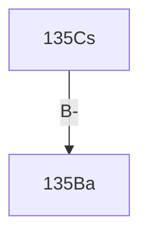

$$\begin{align}
N_{1}(t) &= N_1(0)\times\times\left( e^{-\lambda_{1}t}\right) \\
N_{2}(t) &= N_1(0)\times\lambda_{1}\times\left(\frac{ e^{-\lambda_{1}t}}{(\lambda_{2}-\lambda_{1})}+\frac{ e^{-\lambda_{2}t}}{(\lambda_{1}-\lambda_{2})}\right) \\
&=-N_1(0)\times\left(e^{-\lambda_1t}-1\right)
\end{align}
$$
